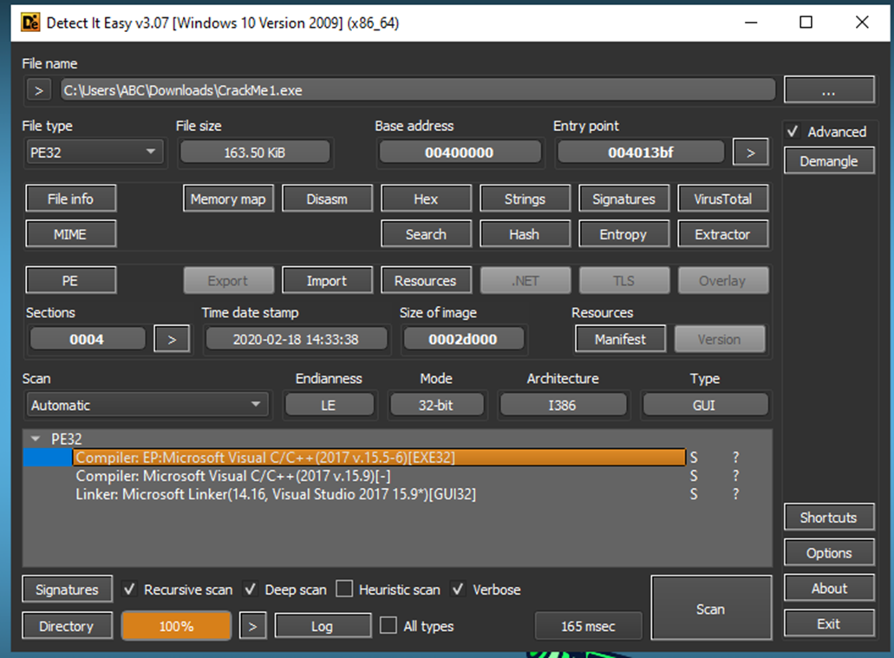
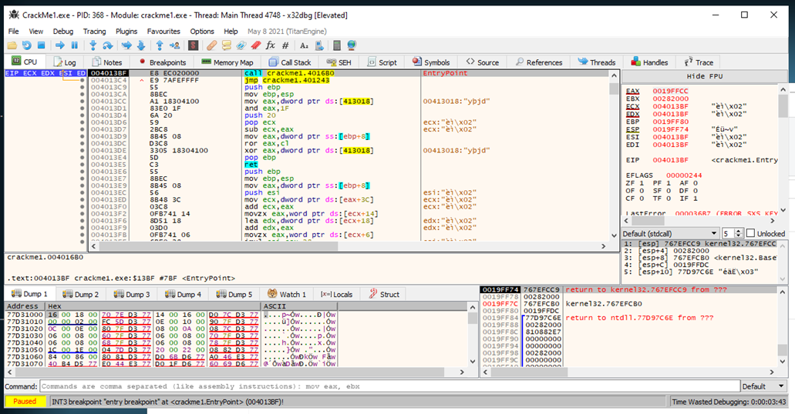
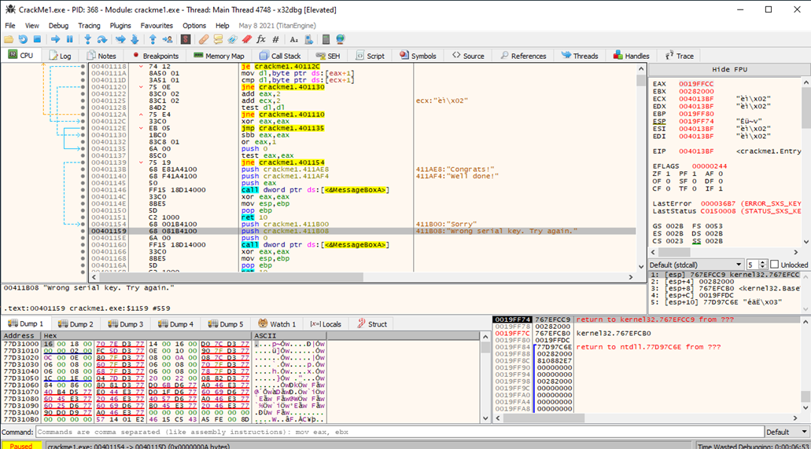
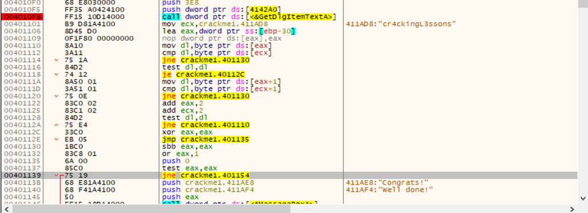
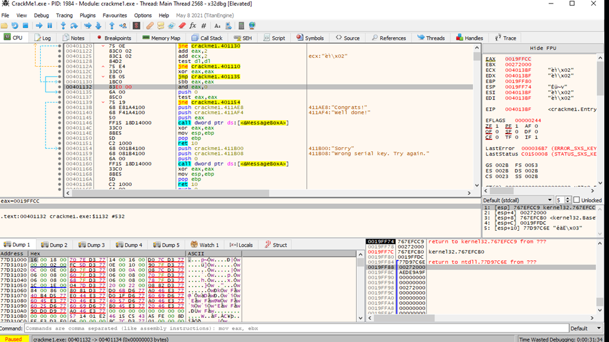
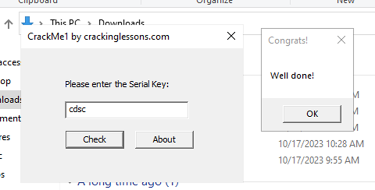

#**CRACKING LESSONS**

##**Crackme #1:**

- Sử dụng DIE để check address của entry point là 004013bf.

- Mở x32dbg, run và xác nhận entry point.

- Khi run tiếp thì sẽ ra cửa sổ nhập pass, việc cần làm là break. Ta tìm các string references và tìm location của chuỗi thông báo “try again”:

- Nhìn ngay trên có thông báo congrats, và đây là thông báo mà ta muốn hiển thị.

- Có 1 tham chiếu GetDIgItemTextA để lấy item từ text nhập pass. Dòng 00401139 có 1 conditional jump, dựa theo dòng test eax ở trên để compare với “cr4ckingL3ssons”, nếu eax = 0 thì dòng congrats được hiển thị, ngược lại sẽ nhảy đến thông báo sai. Như vậy pass là cr4ckingL3ssons.

- Để luôn hiển thị dialog well done, ta cần sửa giá trị của eax thành 0 để luôn đúng.

- Patch file và chạy thử:

