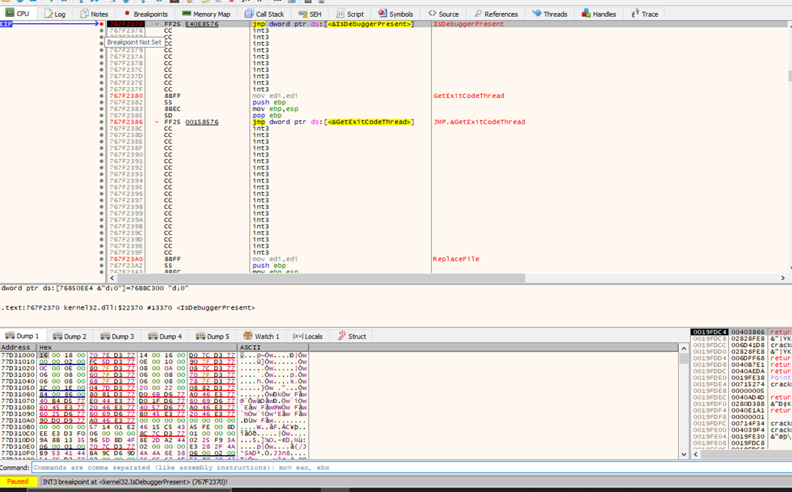
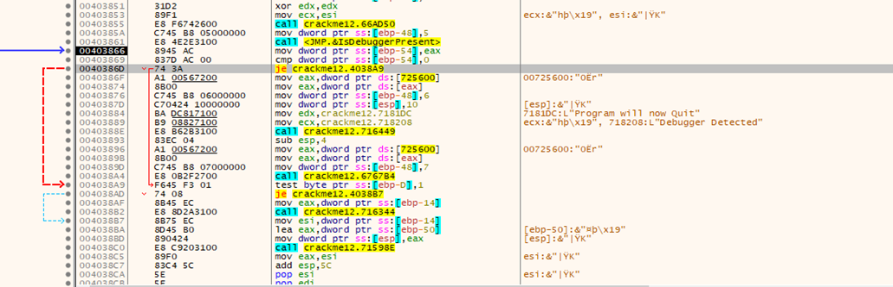
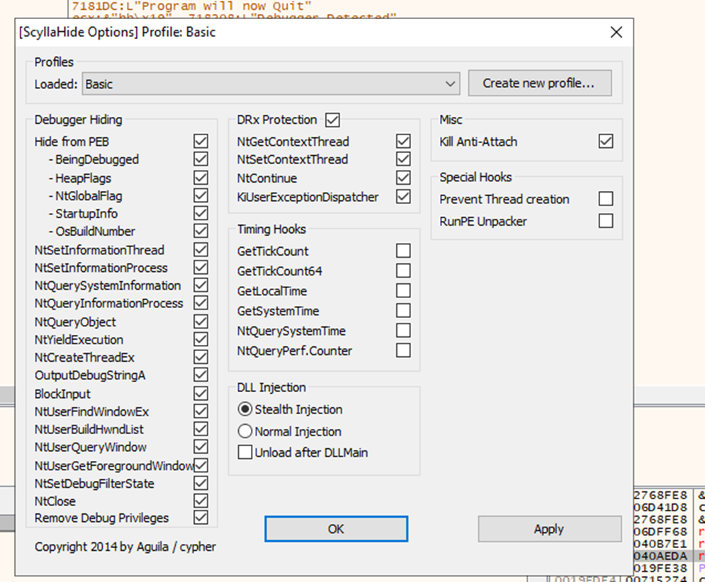

#**CRACKING LESSONS**

##**Crackme #12:**

- Ta sẽ thử tìm kiếm với hàm debugger thông dụng IsDebuggerPresent.
Gõ bp IsDebuggerPresent vào command, ta tìm được vị trí của anti-debugging:

- Ta chọn run to user code:

Nhận thấy có 1 lệnh je, nó sẽ không nhảy vì phát hiện debug, do đó sửa thành jmp để nhảy qua.
Nếu dung plugins, có thể sử dụng ScyllaHide để gỡ lỗi debug:
