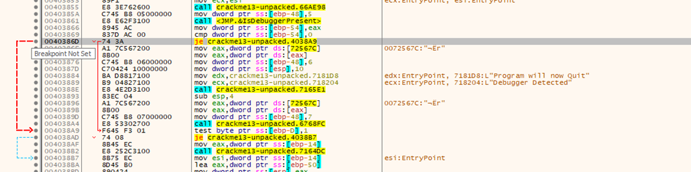
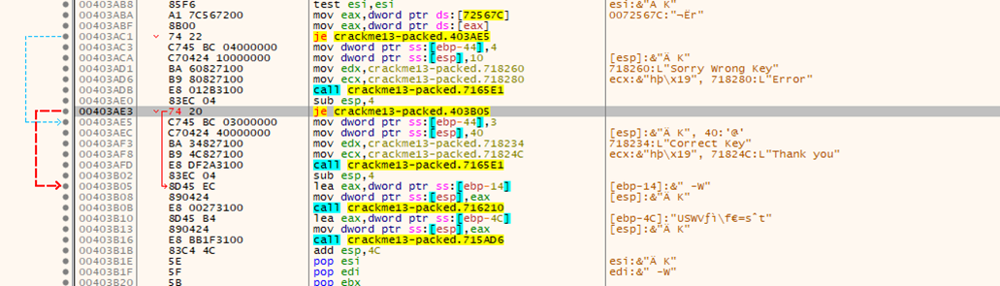
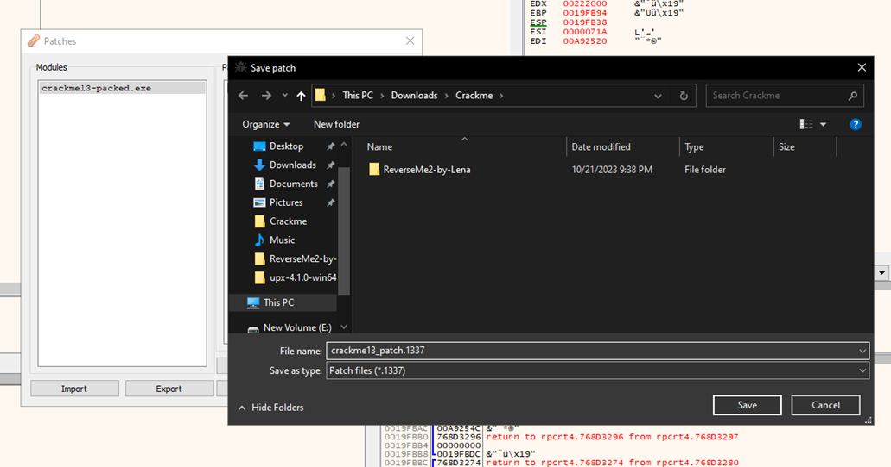
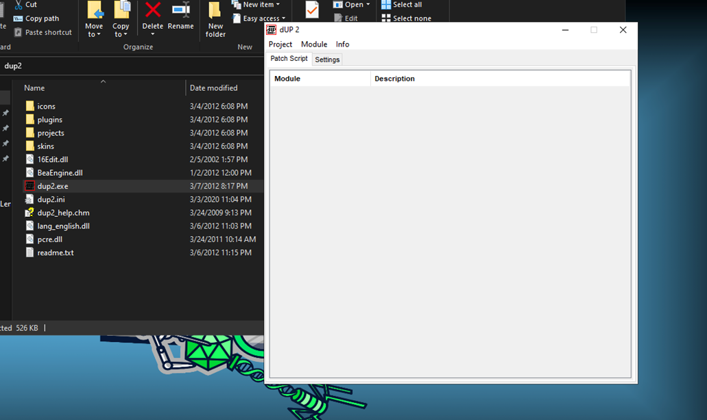
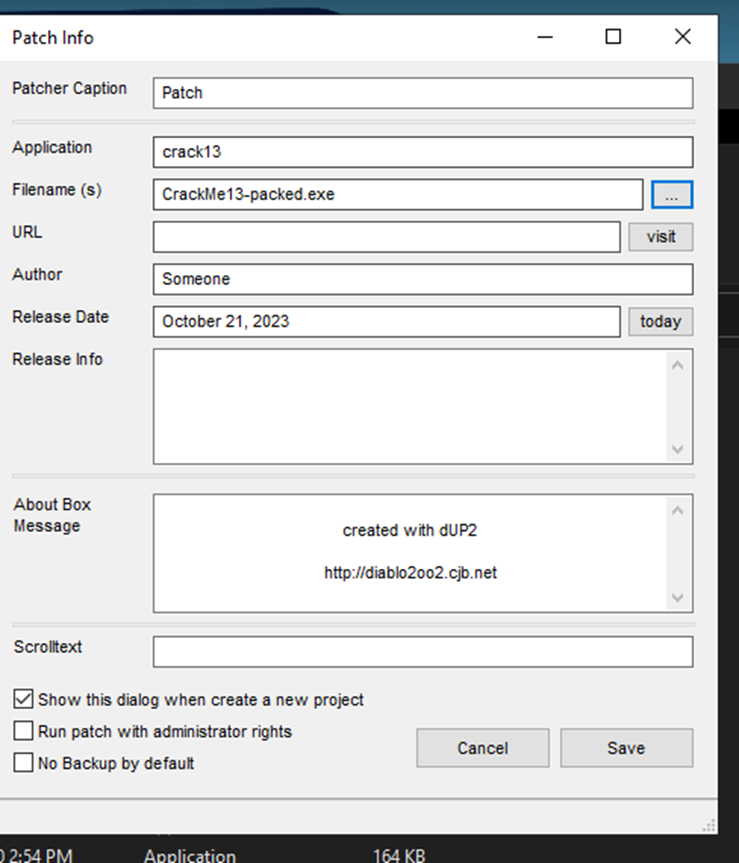
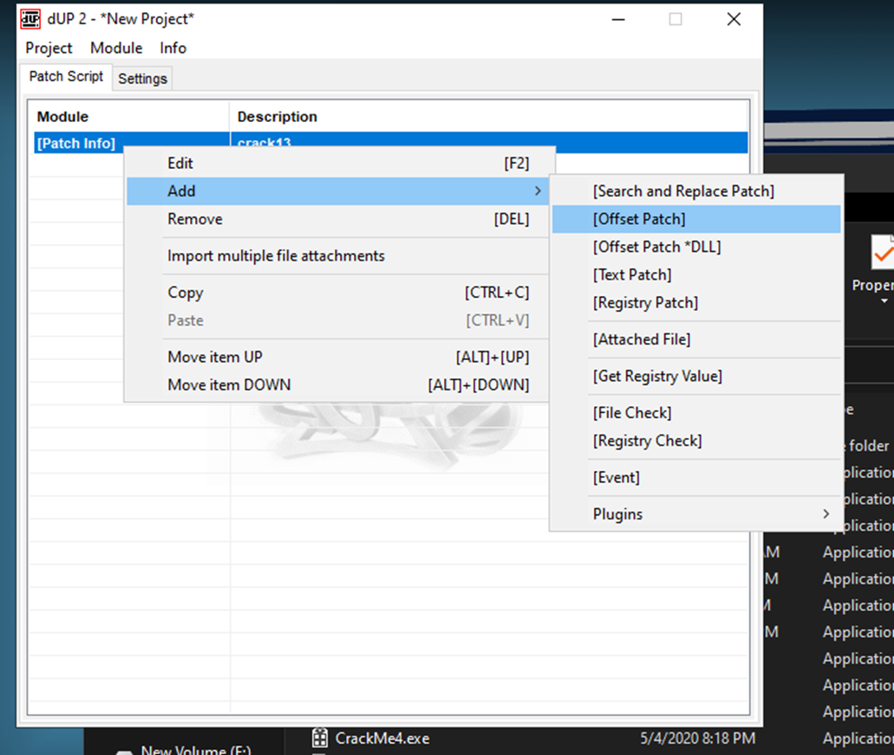
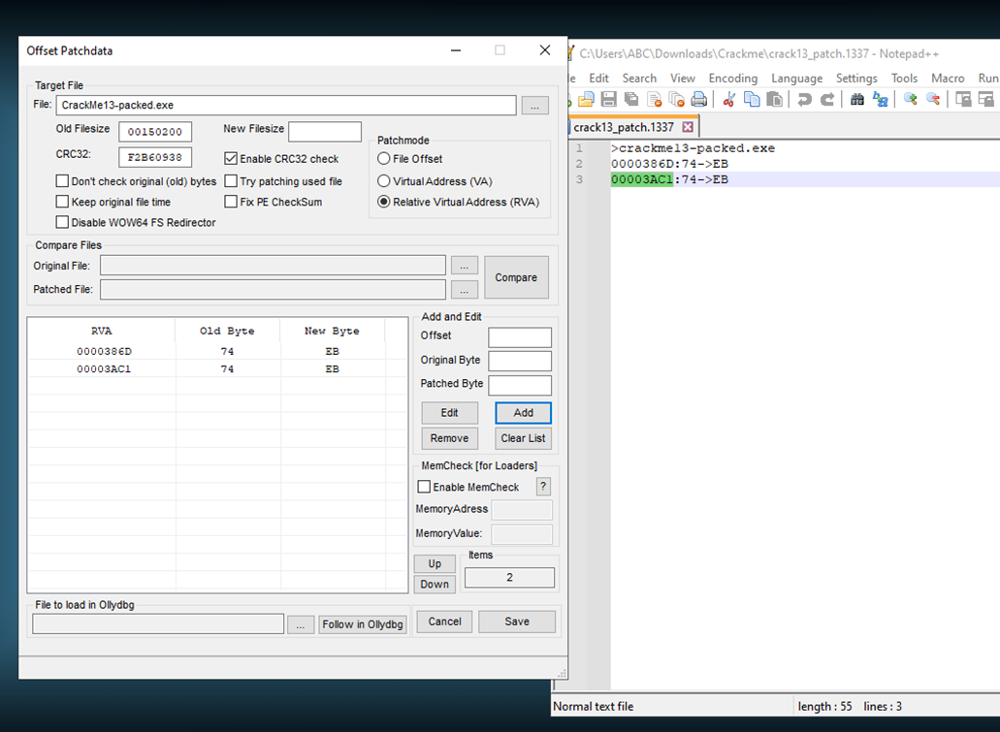
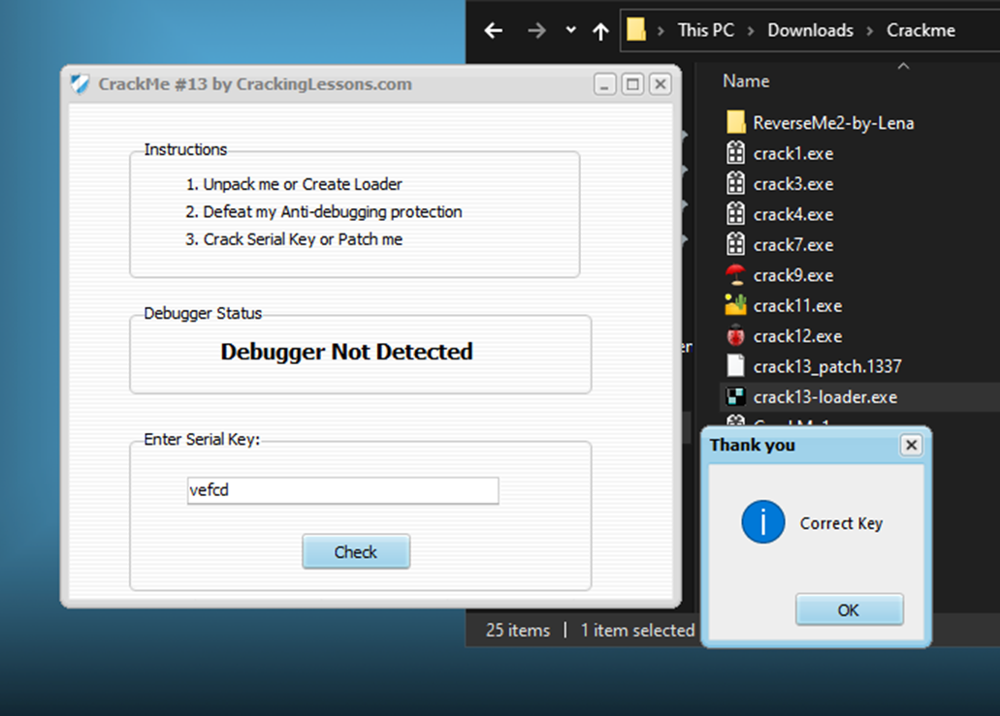

#**CRACKING LESSONS**

##**Crackme #13:**

- Tiếp tục như bài 12, sửa je thành jmp để bypass anti-debugging. 

- Sửa tiếp để pass bước sai key.
Và ta export ra dạng .1337 để lưu lại vị trí patch:

- Việc còn lại là patch serial key bằng cách tạo loader file, ở đây ta sử dụng DUP2 từ trang của crackinglessons.

+ Tạo 1 project mới từ file ban đầu:

+ Tạo thêm offset patch:

+ Edit offset patch: (Chọn RVA và điền offset từ file .1337 ở trên)

+ Tạo 1 simple loader (project -> create loader):
