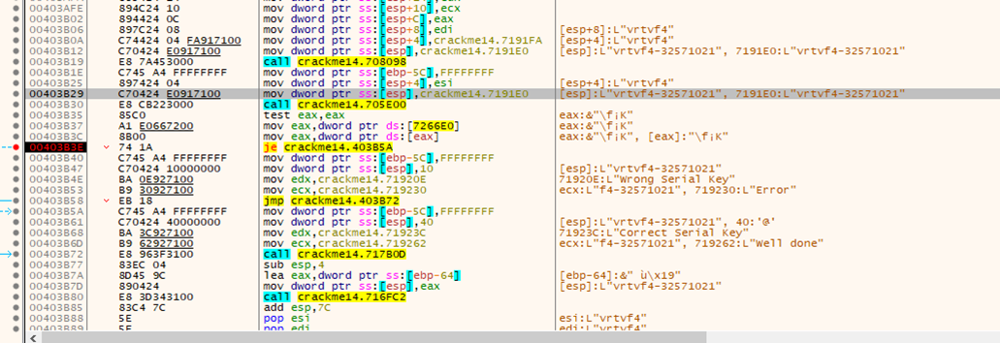
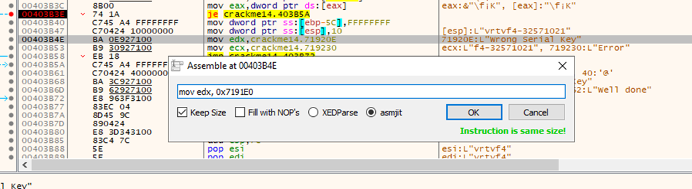
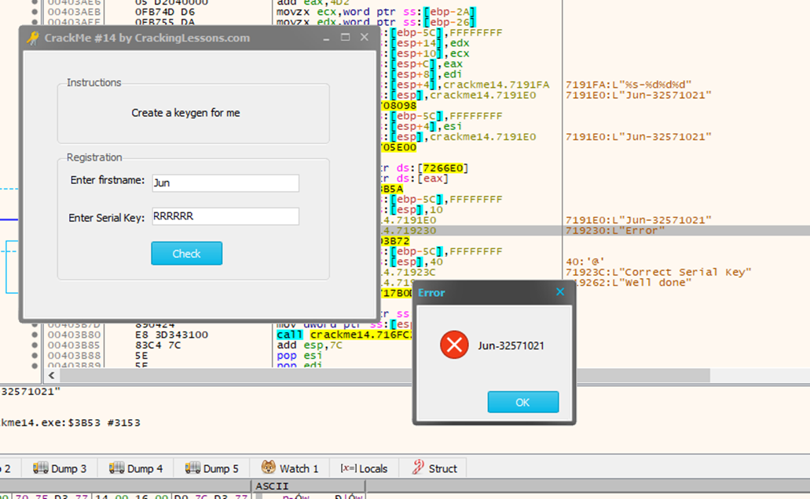

#**CRACKING LESSONS**

##**Crackme #14:**

- Trước hết ta tìm vị trí của dòng Wrong Key:

- Khi nhập sai key thì sẽ như hình trên. Ta cần thay đổi địa chỉ 71920E ở dòng 00403B4E thành 1 địa chỉ khác. Ta thấy trên dòng 00403B29 có địa chỉ 7191E0 là nơi lưu key vừa tạo và sửa thành địa chỉ đó:

- Sau khi sửa xong, data được copy xuống và sẽ generate key theo first name:

Như thế, chỉ cần patch file, sau mỗi lần nhập sẽ tự generate ra key và nhập vào là thoả mãn.