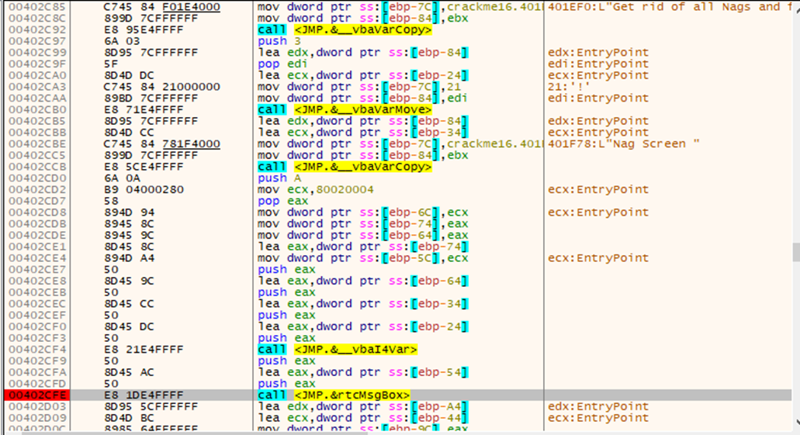
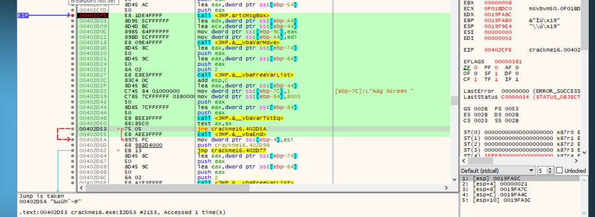
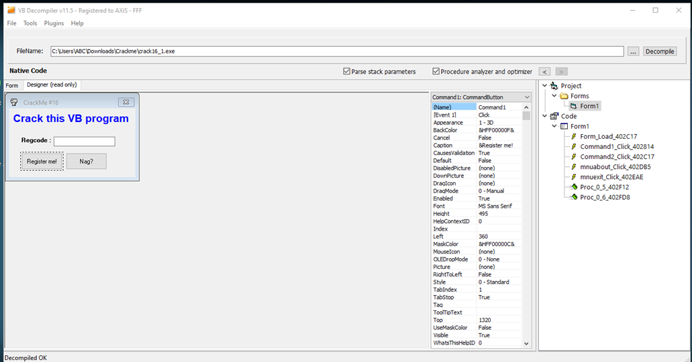
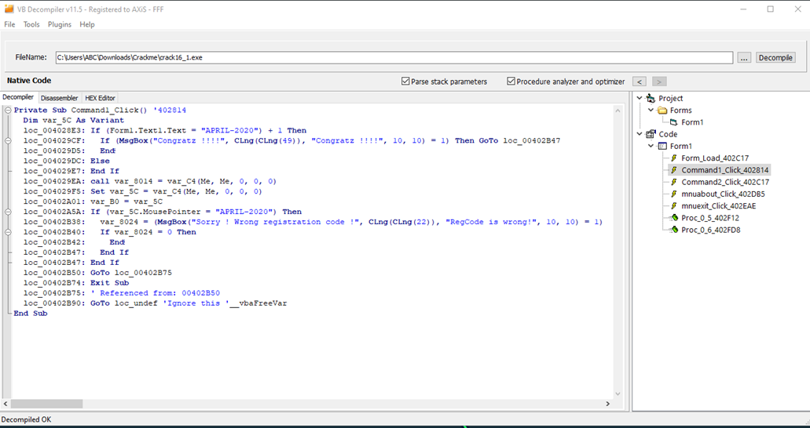
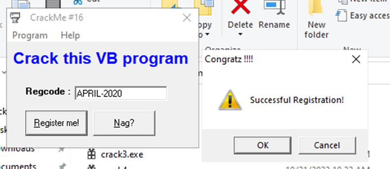

#**CRACKING LESSONS**

##**Crackme #16:**

- Tìm string reference ứng với thông báo remove nag:

- Dòng 00402E4C là dòng hiện lên hộp thoại remove nag. Ta đặt breakpoint ở đó, sau đó đổi thành nop, kết hợp dung trace word và thu được như hình dưới:

Chạy đến dòng 00402D55 là kết thúc, như vậy khả năng lệnh jne đã không được thực hiện. Ta sửa thành jmp và như vậy hộp thoại nag đã biến mất.

- Để crack file vbs, ta sử dụng phần mềm VB Decompiler.

- Hộp thoại register ứng với command 1, vì thế ta có thể kiểm tra code ở phần Command 1:

Như ta thấy có đoạn so sánh text nhập vào với chuỗi “APRIL-2020”, đây chính là register key cần tìm.
