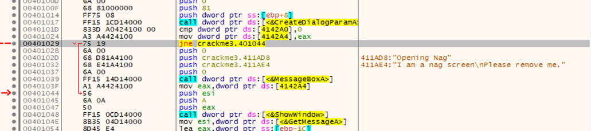
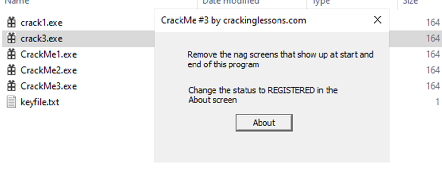
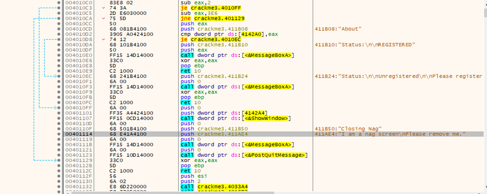
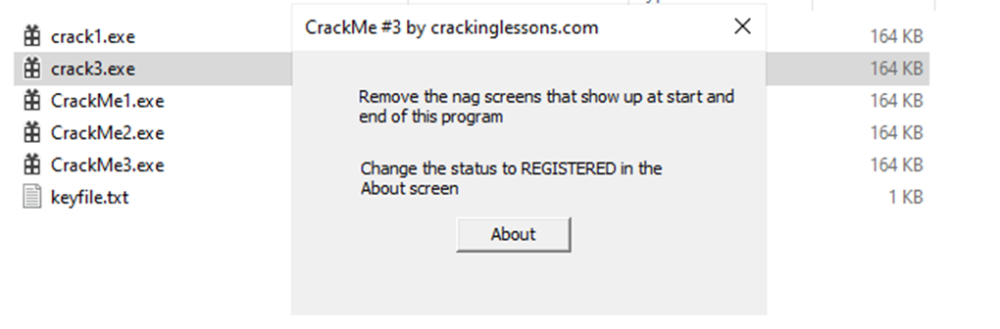
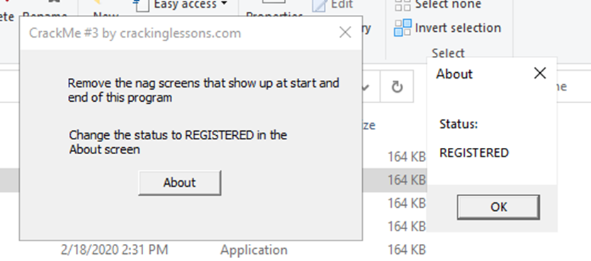

#**CRACKING LESSONS**

##**Crackme #3:**

- Đi đến nơi có thông báo đầu tiên:

- Ở dòng 00401029 có 1 lệnh jump dựa theo việc so sánh ở dòng 0040101D để hiện messagebox ở dòng 00401039.
Ta chỉ cần sửa jne thành je để bypass box đầu.

- Ở đây đã skip box đầu, giờ tìm vị trí box 2.

- Giữa MessageBoxA và PostQuitMessage (là vùng để hiện dialog 2), ta cần jump đến vị trí đó, nhưng do không có lệnh jump sẵn nên ta cần tự set jump command. Ta sửa dòng 0040110D thành push 0x401121, và pass được box 2:

- Ở đoạn registered, ta thấy dòng 004010D8 có lệnh je dựa trên lệnh compare eax ngay trên. Ta sửa thành jne để nó không jump xuống dòng unregistered (cho giá trị khác nhau).
