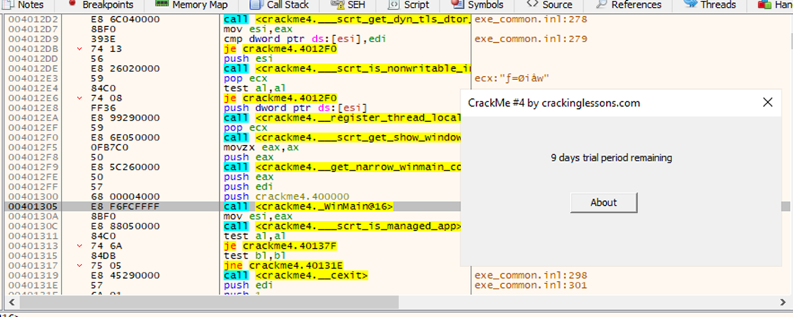
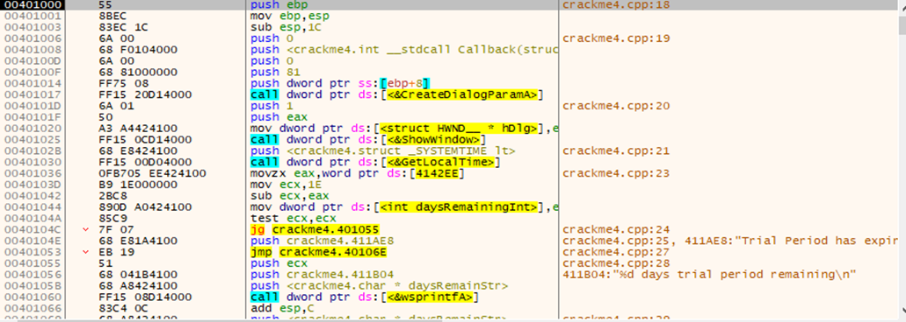
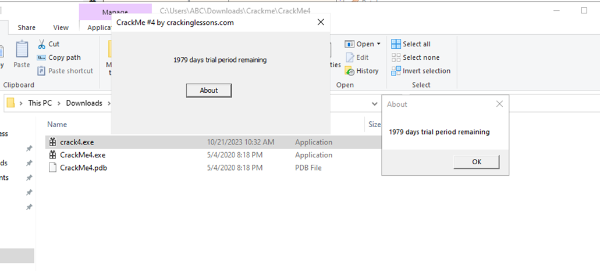

#**CRACKING LESSONS**

##**Crackme #4:**

- Đi đến dòng hiển thị hộp thoại, step into vào hàm:

- Sau khi step into:

- Dòng 00401056 lấy giá trị ngày từ ecx, ecx được nạp vào từ dòng 0040103D, trừ với ngày hiện tại ở dòng 00401042 (eax lấy từ GetLocalTime, sau lệnh CreateDialogProgramA) và thực hiện test ngay sau đó.
- Ở dòng 0040103D, ta chỉ cần sửa 1E thành 1 giá trị lớn bất kì, ví dụ 2000.

Sau khi patch file ta đã gia hạn được số ngày trial như hình bên dưới:
