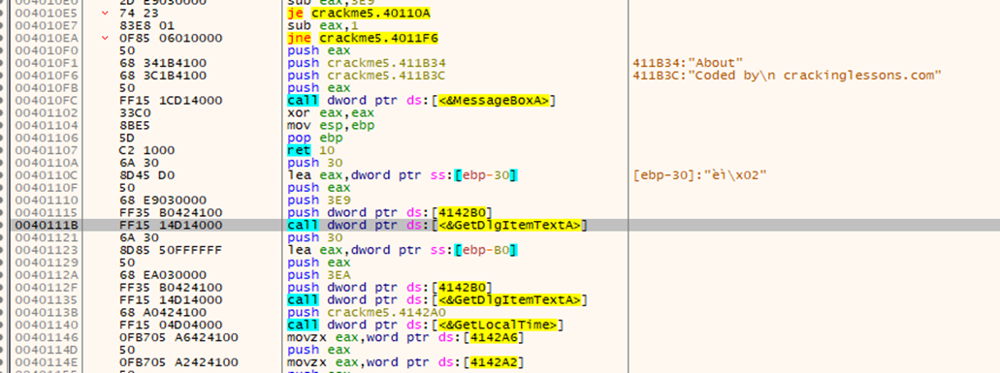
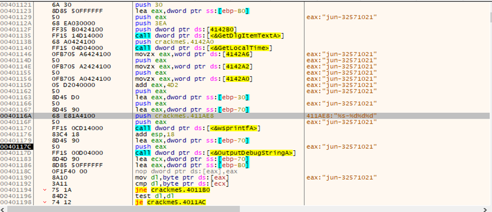
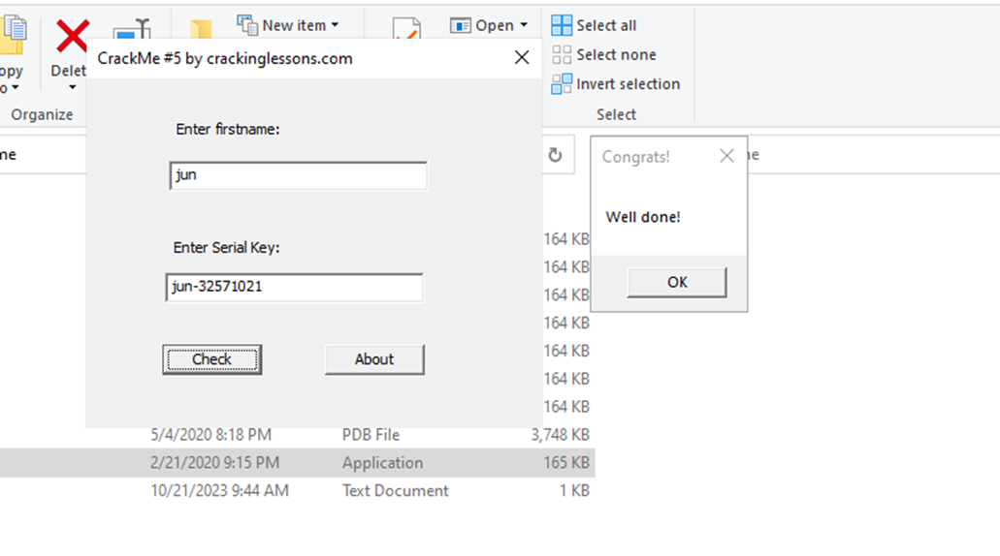

#**CRACKING LESSONS**

##**Crackme #5:**

- Tìm vị trí của dòng try again và lên trên 1 chút:

- Ta thấy hàm GetDlgItemTextA để lấy text từ message box. Đặt breakpoint ở đó và xem xét bên dưới:

- Sau khi step over đến dòng 0040116A, ta thấy chuỗi %s-%d…, đó là định dạng chuỗi – số, có thể đây là chỗ để generate key. Chạy them vài bước nữa, key sẽ được tạo ra, đó là sự kết hợp của tên người dung và chuỗi số cố định, là 32571021.

