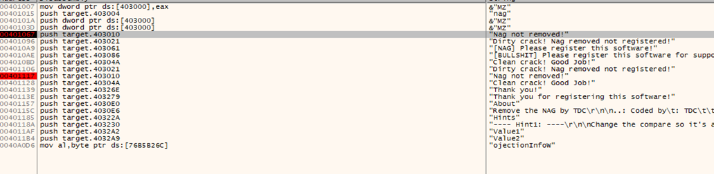

#**CRACKING LESSONS**

##**Crackme #6:**

- Ta tìm đến thông báo thứ nhất:

- Có 1 lệnh jump nhảy đến do chưa registered và hiện các thông báo register như trên. Do đó ta fill with nop từ dòng 004010A7 đến 00401086 (để không hiển thị dialog nữa):

- Để thay đổi trạng thái khi ấn re-check, ta cần tìm đoạn not registered:

- Đặt breakpoint tại các điểm đó và chạy thử:

- Khi chạy đến breakpoint 1, ấn re-check sẽ nhảy sang breakpoint 2:

- Ta đặt breakpoint ở lệnh je. Nhận thấy là nó sẽ nhảy vào thông báo Nag not removed, và ZF cần được đổi sang 0:

- Nhưng đến đây nó lại đi vào 1 lệnh jump khác, và “jump is not taken” cho thấy nó sẽ không nhảy đến đó, vì thế cần phải cho phép jumpo bằng cách đổi ZF thành 1, khi đó đã thay đổi được trạng thái:
