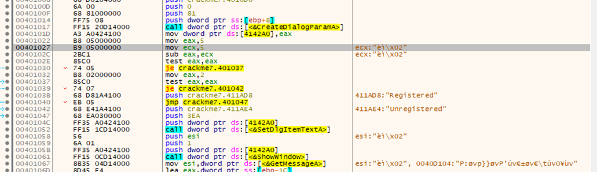
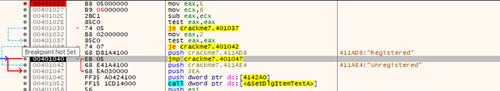
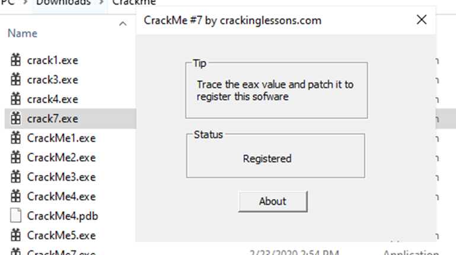

#**CRACKING LESSONS**

##**Crackme #7:**

- Ta tìm vị trí của mục Registered:

- Bài lab gợi ý đến eax value. Ta nhìn thấy cả eax và ecx đều nhận là 5, và khi trừ đi (lệnh sub) thì eax = 0, dẫn đến kết quả phép test eax, eax là đúng và dẫn đến dòng unregistered. Do đó, phải cho eax và ecx khác nhau bằng cách sửa 1 trong 2, ví dụ sửa ecx thành 6:

Khi đó logic thay đổi và nó sẽ qua dòng registered:
