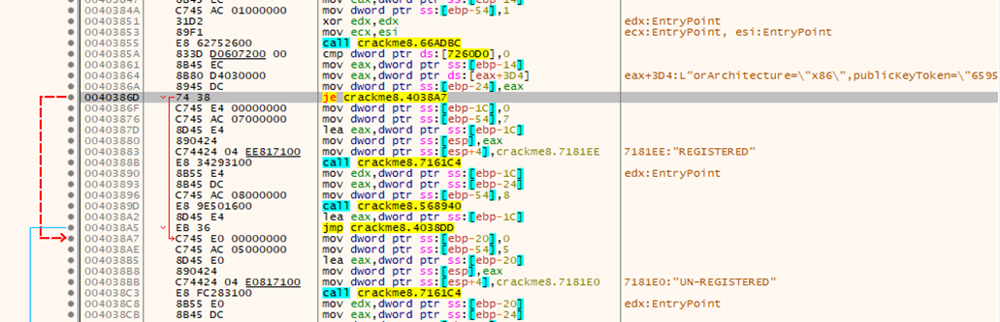
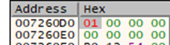
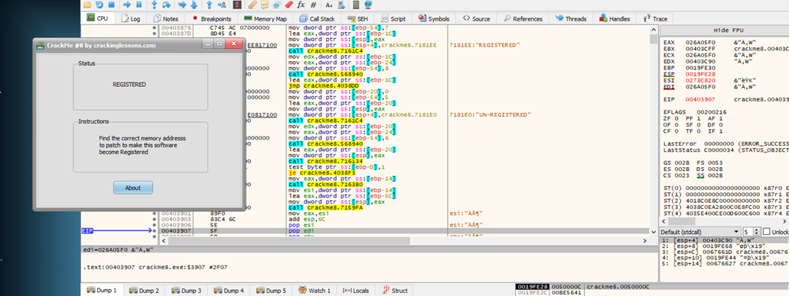

#**CRACKING LESSONS**

##**Crackme #8:**

- Tìm đến vị trí registered:

- Ta thấy có 1 lệnh jump dựa trên lệnh compare giá trị dòng 7260D0 và 0, nếu bằng nhau thì ZF = 1 và lệnh nhảy thực hiện. Ta cần ngăn chặn việc jump bằng cách thay đổi giá trị dòng 7260D0 thành 1 số khác 0:

Kết quả:
