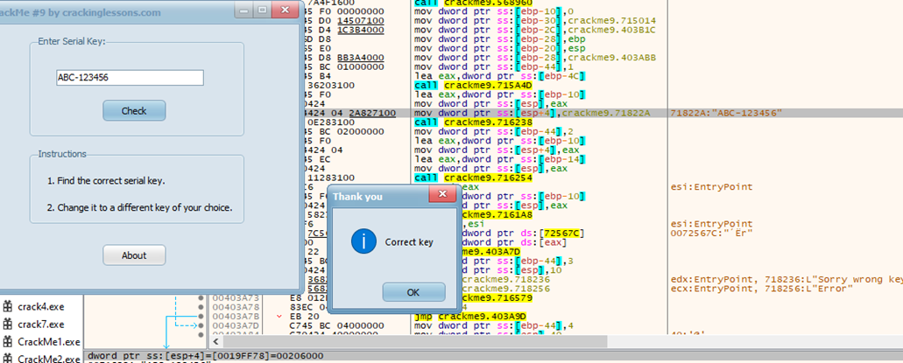
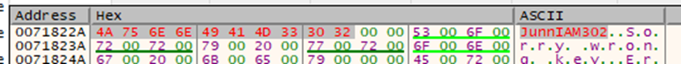
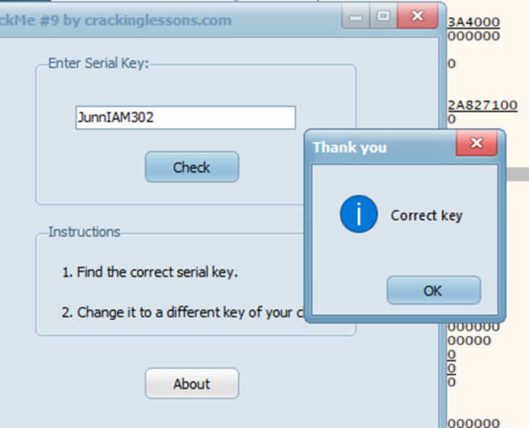

#**CRACKING LESSONS**

##**Crackme #9:**

- Tìm string references, ta thấy có chuỗi ABC-123456 có nhiều khả năng là key nhất, thử thấy thoả mãn:

- Nhận thấy key lưu ở dòng 71822A, nên ta có thể thay đổi data dòng này để có key theo ý mình:

Kết quả:
